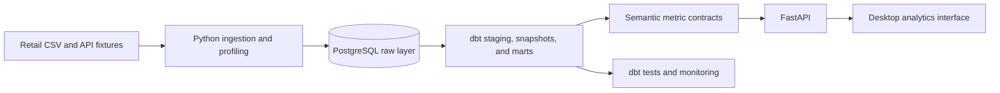

<h1 align="center">NextGen Analytics Platform</h1>

<p align="center">
  An end-to-end analytics engineering platform that turns fragmented commercial and operational signals into account, revenue, retention, and data-quality decisions.
</p>

<p align="center">
  <a href="https://victorn198.github.io/data-pipeline-portfolio/"><strong>Open interactive product tour</strong></a>
  · <a href="README.pt.md">Português</a>
  · <a href="assets/gallery/nextgen-demo.webm">90-second walkthrough</a>
  · <a href="docs/DEMO_SCRIPT.md">Demo script</a>
</p>

<p align="center">
  <a href="https://github.com/victorn198/data-pipeline-portfolio/actions/workflows/dbt_run.yml"></a>
  
  
  
  
</p>


## The business challenge

Revenue alone does not explain which accounts require attention. Commercial teams need to combine billing exposure, support pressure, customer activity, and purchasing behavior without losing metric governance or source traceability.

NextGen provides an investigation workflow that answers:

- Which accounts need attention now, and which signal created the priority?
- Where are revenue and product concentration creating commercial risk?
- Are source failures or quality issues affecting trusted metrics?
- Can an analyst move from an executive signal to the underlying account or record?

## Strongest decision workflow: Account Health


The Account Health mart combines CRM, billing, support, and ecommerce signals into an explainable watchlist. Users can identify the account, inspect the reason for risk, compare context, and register a follow-up action.

This is the main portfolio narrative: **signal -> responsible account -> contributing evidence -> next action**.

## Product experience

<p align="center">
  
  
</p>

- **Revenue and product decisions:** net sales, Pareto/ABC, ticket, retention, and commercial concentration.
- **Source Health:** registered loads, duplicate keys, null profiling, and promotion readiness.
- **Investigation tools:** Spotlight, Compare, Bookmarks, Recent activity, and Action Board.
- **Governed intake:** isolated CSV/JSON preview and profiling before a source can affect certified KPIs.

## Architecture



Orders, CRM, billing, support, and marketing data are modeled at explicit grains. dbt tests and snapshots protect the path from raw ingestion to decision-ready marts.

Explore the [architecture](./docs/ARCHITECTURE.md), [data lineage](./docs/DATA_LINEAGE.md), [dbt models](./docs/DBT_MODELS.md), and [metric dictionary](./docs/MEASURE_DICTIONARY.md).

## Engineering evidence

- 100,000 public retail transaction lines with governed raw, staging, mart, and semantic layers.
- PostgreSQL warehouse modeled and tested with dbt, including snapshots.
- Multi-source account-health mart across CRM, billing, support, and ecommerce fixtures.
- FastAPI contracts for certified analytics delivery.
- Automated API tests, metric audit, dbt tests, and dashboard performance benchmark.
- Security controls for CORS, mutations, tokens, asset access, and atomic governed-state writes.
- Reproducible Windows launcher for environment setup, warehouse build, tests, and demo startup.

## Run locally

### Fastest Windows path

```powershell
git clone https://github.com/victorn198/data-pipeline-portfolio.git
cd data-pipeline-portfolio
.\scripts\run-demo.ps1
```

Prerequisites: Python 3.10+ and Docker Desktop or local PostgreSQL. The launcher creates the environment, starts PostgreSQL, loads sources, builds and tests dbt models, and opens the Account Health walkthrough.

For manual setup and validation commands, see [Deployment](./docs/DEPLOYMENT.md) and [Quality Gates](./docs/QUALITY_GATES.md).

## Data disclosure

The ecommerce layer uses a public UCI Online Retail sample. CRM, billing, support, and marketing records are synthetic fixtures created for this case. No client data is included.

## AI collaboration

AI assisted repetitive implementation, refactoring, testing, documentation, and review. Business framing, metric definitions, acceptance criteria, and final validation remained human decisions. See the full [AI collaboration disclosure](./docs/AI_COLLABORATION_DISCLOSURE.md).

## Portfolio references

- [Account Health case study](./docs/ACCOUNT_HEALTH_CASE_STUDY.md)
- [Project interview narrative](./docs/PROJECT_INTERVIEW_NARRATIVE.md)
- [Predictive outlook method](./docs/PREDICTIVE_OUTLOOK_METHOD.md)
- [Statistical analytics stack](./docs/STATISTICAL_ANALYTICS_STACK.md)
- [Security](./SECURITY.md)
