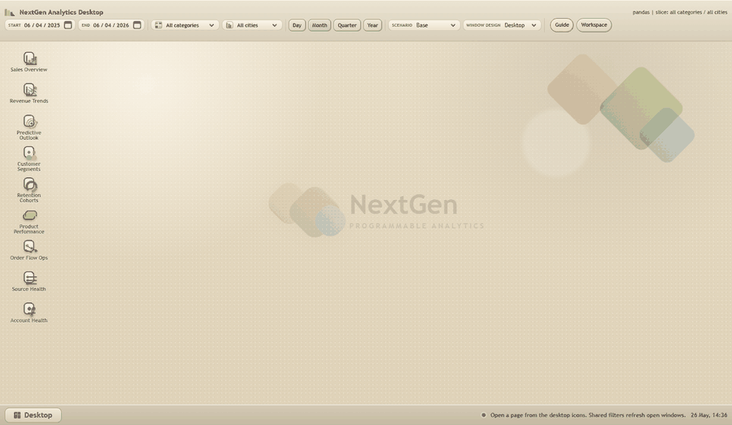
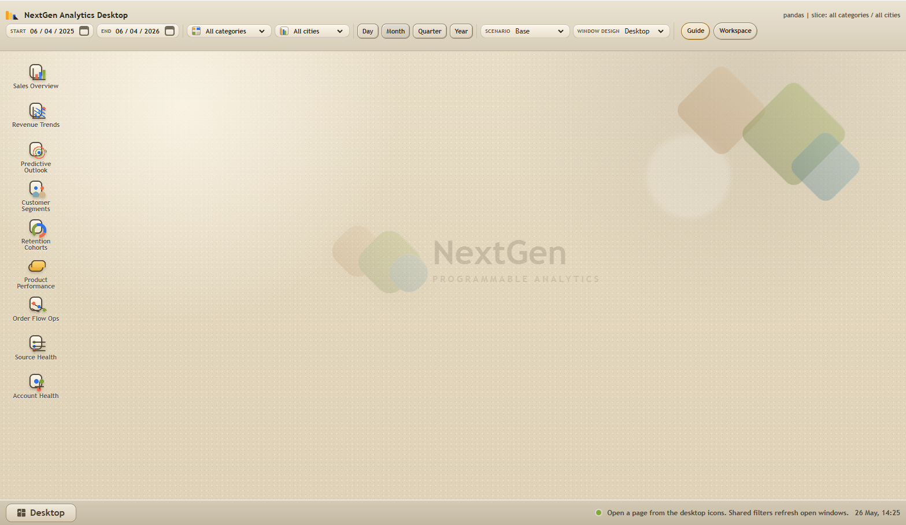
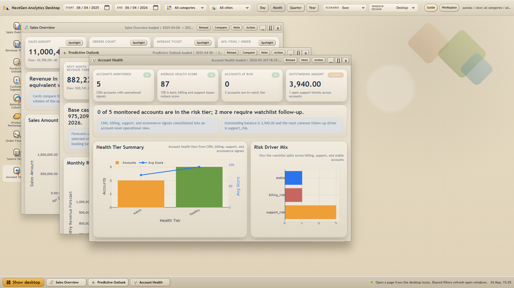

# Data Pipeline Portfolio


Portfólio de analytics engineering com interface `desktop-first`, construído com
`Python`, `PostgreSQL`, `dbt`, `FastAPI` e uma camada própria de
produto analítico.

Este repositório foi organizado como estudo de caso. A ideia não é mostrar só
um dashboard final, mas a cadeia completa: ingestão, modelagem de warehouse,
testes, monitoramento, semântica, API e experiência de análise.

## Resumo rápido

- `100.000+` linhas de pedidos simuladas
- `10.000` clientes e `2.000` produtos
- warehouse com `dbt`, testes e snapshot
- backend FastAPI e frontend analítico em formato desktop
- análises de negócio além de KPI básico:
  - Pareto / `ABC`
  - `RFM`
  - cohorts de retenção
  - anomalias e mudanças estruturais
  - cenários preditivos
- recursos de produto:
  - `Data Center`
  - `Spotlight`
  - `Compare`
  - `Bookmarks`
  - `Recent`
  - `Action Board`
- visão de confiabilidade das fontes:
  - seleção de fontes e preview local de CSV/JSON dentro do app
  - profiling automatico de arquivos, classificacao do dataset, sugestao de mapeamento e janela isolada `Imported Dataset`
  - últimas cargas de fontes registradas
  - profiling de nulos e chaves duplicadas
  - metadados de batch dentro do desktop analítico
- visão de saúde operacional de contas:
  - CRM, billing, suporte e ecommerce unidos em um mart governado
  - watchlist de risco por conta, tickets abertos e saldo pendente

## O que o projeto demonstra

- ingestão em camada `raw`
- ingestão registrada de fontes CSV/JSON/API simulada com metadados de carga e profiling
- intake local sem programacao dentro do app: parsing de CSV/JSON, perfil das colunas, sugestao de mapeamento e analise preview antes de qualquer promocao governada
- modelagem de warehouse com `dbt`
- testes e objetos de qualidade de dados
- definição semântica de métricas de BI
- entrega analítica via API
- uma UX desktop para investigação, não só um dashboard estático

## Galeria



Arquivo de gravação interativa: [nextgen-demo.webm](./assets/gallery/nextgen-demo.webm)






Case de Account Health:

- [Account Health Case Study](./docs/ACCOUNT_HEALTH_CASE_STUDY.md)
- [Portfolio Application Material](./docs/APPLICATION_MATERIAL.md)
- [Demo Script](./docs/DEMO_SCRIPT.md)
- mart dbt: `dbtproject/models/marts/mart_account_health.sql`
- endpoint de API: `GET /api/account-health`

## Arquitetura


## Estrutura de warehouse


A imagem acima é derivada da estrutura do repositório, não de uma GUI de banco
em tempo real. Mantive assim para preservar o desenho técnico mesmo quando o
banco local não está rodando.

## Métodos analíticos incluídos

- comparação entre períodos com alinhamento de bordas parciais
- análise de concentração com Pareto e `ABC`
- segmentação de clientes com `RFM`
- cohorts de retenção
- detecção de anomalias e mudança estrutural
- cenários preditivos: `Base`, `Conservative`, `Upside`
- drilldown até os membros subjacentes

## Recursos de produto incluídos

- navegação desktop com janelas e taskbar
- janela `Data Center` com biblioteca de conectores, seleção de fontes, rascunhos de conexão e analise local de CSV/JSON sem programacao
- janela `Imported Dataset` com qualidade, mapeamento sugerido, auto view, perfil de colunas e amostra isolada dos KPIs oficiais
- `Spotlight` com filtros locais e contexto congelado
- `Compare` para investigação lado a lado
- `Bookmarks` para restaurar workspaces
- `Recent` e `Action Board`
- exportação CSV de detalhes e comparações
- temas visuais dentro do shell desktop
- janela `Source Health` para auditoria e profiling das fontes registradas
- janela `Account Health` para análise operacional de contas e risco de cliente

## Início rápido

### Pré-requisitos

- Python `3.10+`
- Docker Desktop ou PostgreSQL local

### Rodar localmente

```bash
docker compose up -d
cp .env.example .env
python -m venv venv
source venv/bin/activate  # Windows: venv\Scripts\activate
pip install -r requirements.txt
python scripts/loadsampledata.py --mode full_refresh
python scripts/load_registered_sources.py
cd dbtproject
dbt deps
dbt run --full-refresh
dbt snapshot
dbt test
cd ..
uvicorn nextgen_dashboard.backend.main:app --reload --port 8601
```

Acesse `http://127.0.0.1:8601`

## Qualidade e segurança

```bash
pytest tests/test_nextgen_dashboard_api.py
python scripts/benchmark_dashboard.py --threshold-seconds 1.50
```

Hardening aplicado:

- CORS explícito
- mutações de agente desligadas por padrão
- token para mutações quando habilitadas
- allowlist de assets estáticos
- escrita atômica do estado governado

Veja:

- [AI Agent Security](./docs/AI_AGENT_SECURITY.md)
- [Quality Gates](./docs/QUALITY_GATES.md)
- [SECURITY.md](./SECURITY.md)

## Transparência sobre IA

Eu usei IA durante implementação e revisão, e isso está explícito.

A IA ajudou com:

- trabalho repetitivo de implementação
- iteração de UI
- refatoração e limpeza
- expansão de testes
- rascunho de documentação
- apoio em review de segurança

A IA não definiu direção de produto, framing de negócio, critérios de aceite ou
revisão final. Essas decisões continuaram manuais.

Mais detalhe: [AI Collaboration Disclosure](./docs/AI_COLLABORATION_DISCLOSURE.md)

## Guia rápido do repositório

- `fivetran_simulator/`: simuladores de ingestão e geração de amostra
- `fivetran_simulator/source_registry.yml`: contratos governados de fontes em arquivo
- `dbtproject/models/`: transformações do warehouse
- `dbtproject/tests/`: testes SQL
- `nextgen_dashboard/`: backend FastAPI e frontend desktop
- `scripts/setup_*.sql`: monitoramento e objetos operacionais
- `scripts/benchmark_dashboard.py`: benchmark do dashboard
- `assets/gallery/`: screenshots reais e capturas de demo do projeto
- `assets/diagrams/`: visuais de arquitetura e warehouse

## Documentação útil

- [GitHub Repository Setup](./docs/GITHUB_REPOSITORY_SETUP.md)
- [Architecture](./docs/ARCHITECTURE.md)
- [Data Lineage](./docs/DATA_LINEAGE.md)
- [Multi-Source Analytics Roadmap](./docs/MULTI_SOURCE_ANALYTICS_ROADMAP.md)
- [Business Source Decision](./docs/BUSINESS_SOURCE_DECISION.md)
- [dbt Models](./docs/DBT_MODELS.md)
- [Measure Dictionary](./docs/MEASURE_DICTIONARY.md)
- [Predictive Outlook Method](./docs/PREDICTIVE_OUTLOOK_METHOD.md)
- [Statistical Analytics Stack](./docs/STATISTICAL_ANALYTICS_STACK.md)
- [Project Interview Narrative](./docs/PROJECT_INTERVIEW_NARRATIVE.md)
- [Recruiter Review](./docs/RECRUITER_REVIEW.md)
- [LinkedIn and GitHub Copy](./docs/LINKEDIN_PROJECT_COPY.md)
