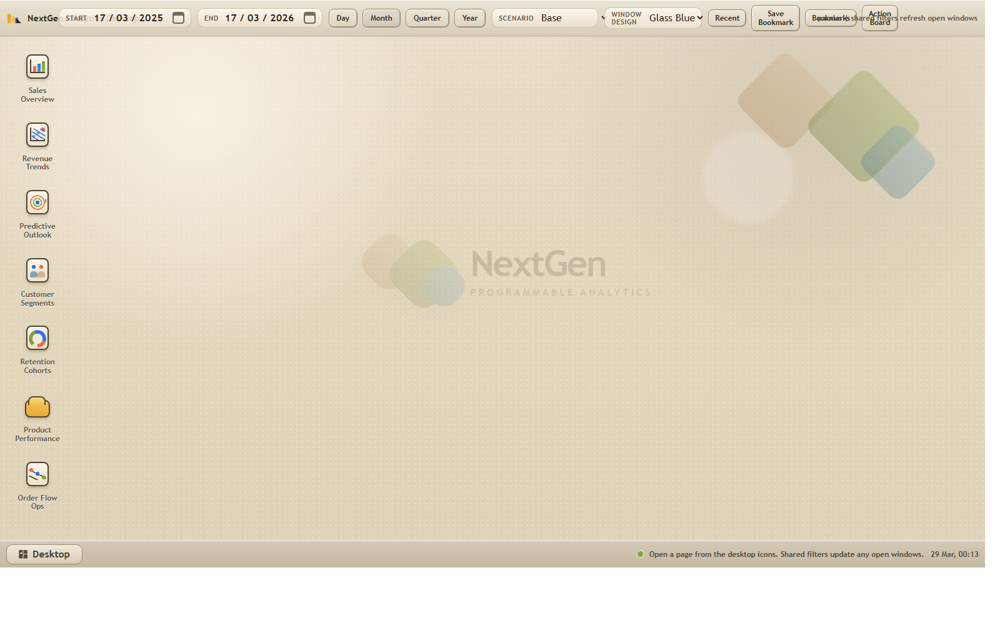
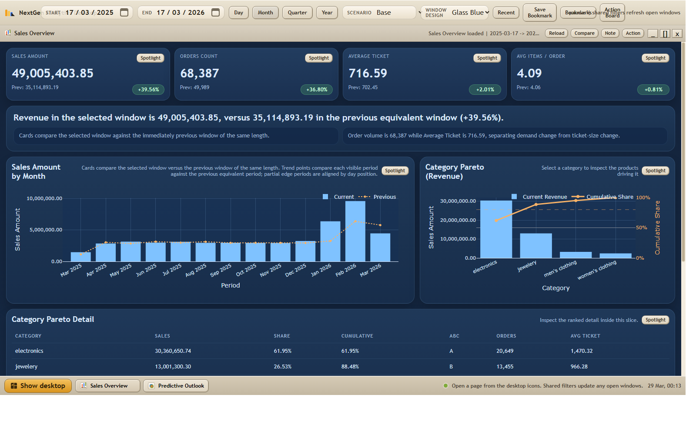
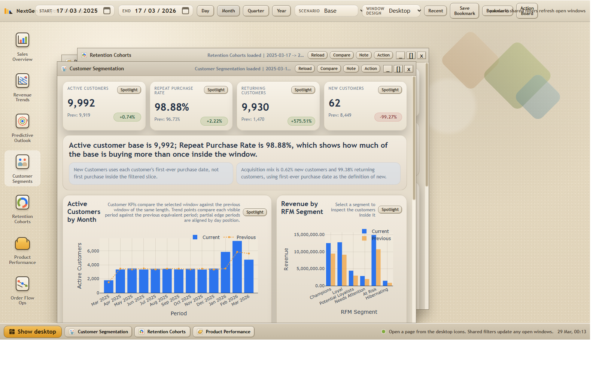
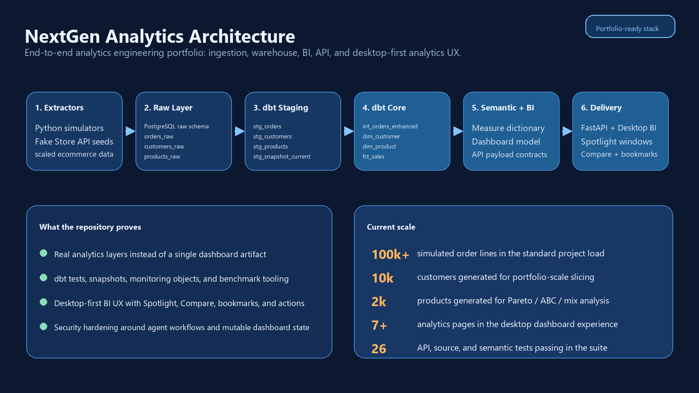
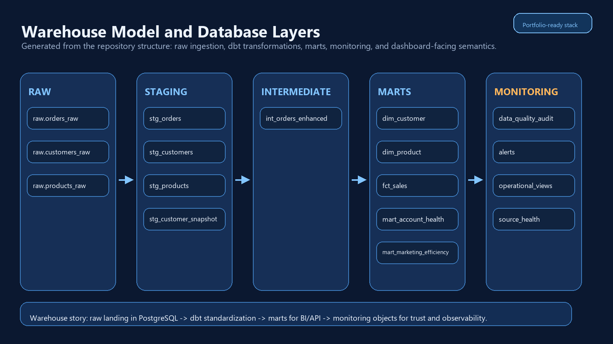

# Data Pipeline Portfolio


Portfólio de analytics engineering com interface `desktop-first`, construído com
`Python`, `PostgreSQL`, `dbt`, `FastAPI`, `Power BI` e uma camada própria de
produto analítico.

Este repositório foi organizado como estudo de caso. A ideia não é mostrar só
um dashboard final, mas a cadeia completa: ingestão, modelagem de warehouse,
testes, monitoramento, semântica, API e experiência de análise.

## Resumo rápido

- `100.000+` linhas de pedidos simuladas
- `10.000` clientes e `2.000` produtos
- warehouse com `dbt`, testes e snapshot
- backend FastAPI e frontend analítico em formato desktop
- análises de negócio além de KPI básico:
  - Pareto / `ABC`
  - `RFM`
  - cohorts de retenção
  - anomalias e mudanças estruturais
  - cenários preditivos
- recursos de produto:
  - `Spotlight`
  - `Compare`
  - `Bookmarks`
  - `Recent`
  - `Action Board`

## O que o projeto demonstra

- ingestão em camada `raw`
- modelagem de warehouse com `dbt`
- testes e objetos de qualidade de dados
- definição semântica de métricas de BI
- entrega analítica via API
- uma UX desktop para investigação, não só um dashboard estático

## Galeria







## Arquitetura



## Estrutura de warehouse



A imagem acima é derivada da estrutura do repositório, não de uma GUI de banco
em tempo real. Mantive assim para preservar o desenho técnico mesmo quando o
banco local não está rodando.

## Métodos analíticos incluídos

- comparação entre períodos com alinhamento de bordas parciais
- análise de concentração com Pareto e `ABC`
- segmentação de clientes com `RFM`
- cohorts de retenção
- detecção de anomalias e mudança estrutural
- cenários preditivos: `Base`, `Conservative`, `Upside`
- drilldown até os membros subjacentes

## Recursos de produto incluídos

- navegação desktop com janelas e taskbar
- `Spotlight` com filtros locais e contexto congelado
- `Compare` para investigação lado a lado
- `Bookmarks` para restaurar workspaces
- `Recent` e `Action Board`
- exportação CSV de detalhes e comparações
- temas visuais dentro do shell desktop

## Início rápido

### Pré-requisitos

- Python `3.10+`
- Docker Desktop ou PostgreSQL local
- Power BI Desktop (opcional)

### Rodar localmente

```bash
docker compose up -d
cp .env.example .env
python -m venv venv
source venv/bin/activate  # Windows: venv\Scripts\activate
pip install -r requirements.txt
python scripts/loadsampledata.py --mode full_refresh
cd dbtproject
dbt deps
dbt run --full-refresh
dbt snapshot
dbt test
cd ..
uvicorn nextgen_dashboard.backend.main:app --reload --port 8601
```

Acesse `http://127.0.0.1:8601`

## Qualidade e segurança

```bash
pytest tests/test_nextgen_dashboard_api.py
python scripts/benchmark_dashboard.py --threshold-seconds 1.50
```

Hardening aplicado:

- CORS explícito
- mutações de agente desligadas por padrão
- token para mutações quando habilitadas
- allowlist de assets estáticos
- escrita atômica do estado governado

Veja:

- [AI Agent Security](./docs/AI_AGENT_SECURITY.md)
- [Quality Gates](./docs/QUALITY_GATES.md)
- [SECURITY.md](./SECURITY.md)

## Transparência sobre IA

Eu usei IA durante implementação e revisão, e isso está explícito.

A IA ajudou com:

- trabalho repetitivo de implementação
- iteração de UI
- refatoração e limpeza
- expansão de testes
- rascunho de documentação
- apoio em review de segurança

A IA não definiu direção de produto, framing de negócio, critérios de aceite ou
revisão final. Essas decisões continuaram manuais.

Mais detalhe: [AI Collaboration Disclosure](./docs/AI_COLLABORATION_DISCLOSURE.md)

## Guia rápido do repositório

- `fivetran_simulator/`: simuladores de ingestão e geração de amostra
- `dbtproject/models/`: transformações do warehouse
- `dbtproject/tests/`: testes SQL
- `nextgen_dashboard/`: backend FastAPI e frontend desktop
- `scripts/setup_*.sql`: monitoramento e objetos operacionais
- `scripts/benchmark_dashboard.py`: benchmark do dashboard
- `assets/gallery/`: screenshots reais do projeto
- `assets/diagrams/`: visuais de arquitetura e warehouse

## Documentação útil

- [GitHub Repository Setup](./docs/GITHUB_REPOSITORY_SETUP.md)
- [Architecture](./docs/ARCHITECTURE.md)
- [Data Lineage](./docs/DATA_LINEAGE.md)
- [dbt Models](./docs/DBT_MODELS.md)
- [Measure Dictionary](./docs/MEASURE_DICTIONARY.md)
- [Predictive Outlook Method](./docs/PREDICTIVE_OUTLOOK_METHOD.md)
- [Statistical Analytics Stack](./docs/STATISTICAL_ANALYTICS_STACK.md)
- [Project Interview Narrative](./docs/PROJECT_INTERVIEW_NARRATIVE.md)
- [Recruiter Review](./docs/RECRUITER_REVIEW.md)
- [LinkedIn and GitHub Copy](./docs/LINKEDIN_PROJECT_COPY.md)
