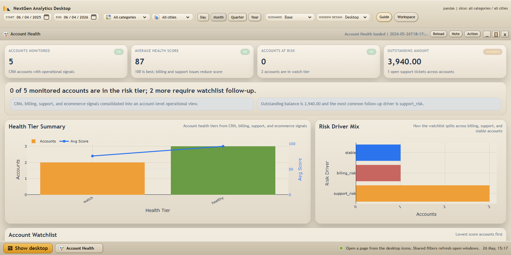
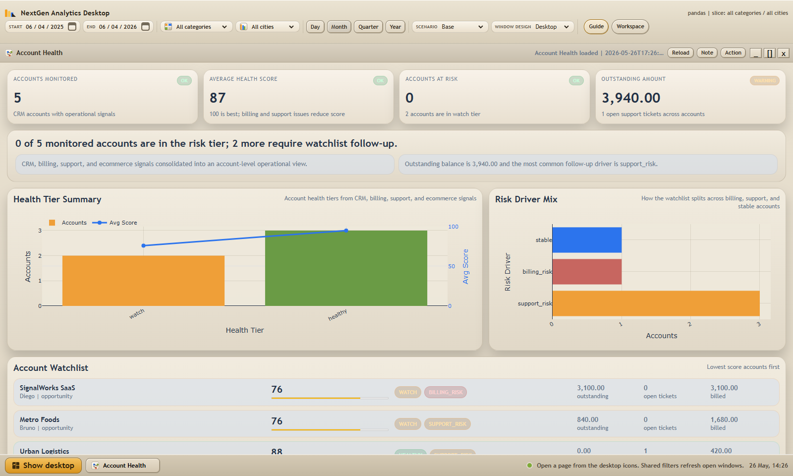
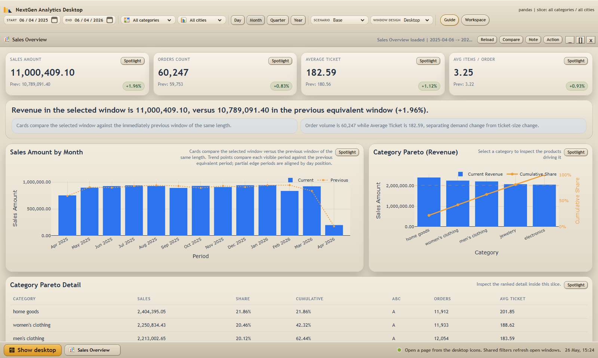
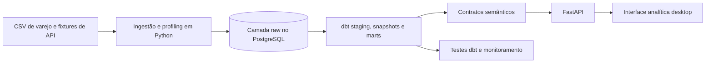

<h1 align="center">NextGen Analytics Platform</h1>

<p align="center">
  Plataforma completa de analytics engineering que transforma sinais comerciais e operacionais fragmentados em decisões de contas, receita, retenção e qualidade de dados.
</p>

<p align="center">
  <a href="https://victorn198.github.io/nextgen-analytics-platform/"><strong>Abrir tour interativo</strong></a>
  · <a href="README.md">English</a>
  · <a href="assets/gallery/nextgen-demo.webm">Vídeo de 90 segundos</a>
  · <a href="docs/DEMO_SCRIPT.md">Roteiro da demonstração</a>
</p>



## O desafio de negócio

Receita isolada não explica quais contas exigem atenção. As equipes precisam combinar exposição financeira, pressão de suporte, atividade do cliente e comportamento de compra sem perder governança ou rastreabilidade.

A NextGen responde:

- Quais contas precisam de atenção e qual sinal criou a prioridade?
- Onde a concentração de receita e produto está criando risco comercial?
- Falhas de fonte ou qualidade estão afetando métricas confiáveis?
- O analista consegue sair do sinal executivo e chegar à conta ou registro responsável?

## Principal fluxo de decisão: Account Health



O mart de Account Health combina CRM, billing, suporte e ecommerce em uma watchlist explicável. O usuário identifica a conta, entende a razão do risco, compara contexto e registra a próxima ação.

A narrativa central do case é: **sinal -> conta responsável -> evidências -> próxima ação**.

## Experiência do produto

<p align="center">
  
  
</p>

- **Receita e produto:** vendas líquidas, Pareto/ABC, ticket, retenção e concentração comercial.
- **Source Health:** cargas registradas, chaves duplicadas, nulos e prontidão para promoção.
- **Investigação:** Spotlight, Compare, Bookmarks, atividade recente e Action Board.
- **Intake governado:** preview isolado de CSV/JSON antes que a fonte afete KPIs certificados.

## Arquitetura



Pedidos, CRM, billing, suporte e marketing são modelados em granularidades explícitas. Testes e snapshots do dbt protegem o caminho da ingestão aos marts de decisão.

Consulte [arquitetura](./docs/ARCHITECTURE.md), [linhagem](./docs/DATA_LINEAGE.md), [modelos dbt](./docs/DBT_MODELS.md) e [dicionário de métricas](./docs/MEASURE_DICTIONARY.md).

## Evidências de engenharia

- 100.000 linhas públicas de transações com camadas raw, staging, marts e semântica.
- Warehouse PostgreSQL modelado e testado com dbt e snapshots.
- Mart multi-source de Account Health com CRM, billing, suporte e ecommerce.
- Contratos FastAPI para entrega de métricas certificadas.
- Testes de API, auditoria de métricas, testes dbt e benchmark de desempenho.
- Controles de CORS, mutações, tokens, acesso a assets e escrita atômica de estado.
- Launcher Windows reproduzível para ambiente, warehouse, testes e demonstração.

## Executar localmente

```powershell
git clone https://github.com/victorn198/nextgen-analytics-platform.git
cd nextgen-analytics-platform
.\scripts\run-demo.ps1
```

Pré-requisitos: Python 3.10+ e Docker Desktop ou PostgreSQL local. Consulte [Deployment](./docs/DEPLOYMENT.md) e [Quality Gates](./docs/QUALITY_GATES.md) para o processo manual.

## Transparência dos dados

A camada de ecommerce usa uma amostra pública UCI Online Retail. CRM, billing, suporte e marketing são fixtures sintéticas criadas para o case. Nenhum dado de cliente está incluído.

## Colaboração com IA

IA auxiliou implementação repetitiva, refatoração, testes, documentação e revisão. Problema de negócio, métricas, critérios de aceite e validação final permaneceram decisões humanas. Consulte a [declaração completa](./docs/AI_COLLABORATION_DISCLOSURE.md).

## Materiais de portfólio

- [Case Account Health](./docs/ACCOUNT_HEALTH_CASE_STUDY.md)
- [Narrativa para entrevista](./docs/PROJECT_INTERVIEW_NARRATIVE.md)
- [Método preditivo](./docs/PREDICTIVE_OUTLOOK_METHOD.md)
- [Stack estatística](./docs/STATISTICAL_ANALYTICS_STACK.md)
- [Segurança](./SECURITY.md)
