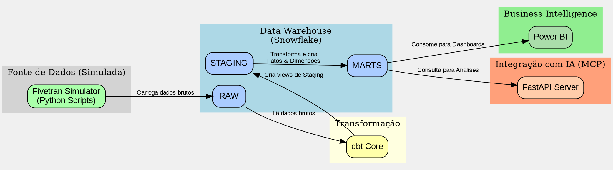

# Data Lineage e Arquitetura

Este documento descreve o fluxo de dados (data lineage) e a arquitetura geral do projeto. O diagrama abaixo foi gerado usando a linguagem DOT do Graphviz e representa o fluxo desde a fonte de dados até a camada de consumo.

---

## Diagrama da Arquitetura

Para visualizar o diagrama, você pode usar um renderizador de Graphviz online ou local.

1.  **Copie o código** abaixo (o conteúdo dentro do bloco de código `dot`).
2.  **Cole em um renderizador online**, como:
    *   [Graphviz Online](http://magjac.com/graphviz-visual-editor/)
    *   [Dreampuf's Graphviz Viewer](https://dreampuf.github.io/GraphvizOnline/)
3.  **Para gerar localmente** (se você tiver o Graphviz instalado), salve o código em um arquivo (ex: `architecture.dot`) e execute o comando:
    ```bash
    dot -Tpng architecture.dot -o architecture.png
    ```

### Código do Diagrama (DOT)



---

## Descrição do Fluxo

1.  **Fonte de Dados**: O `Fivetran Simulator` (um conjunto de scripts Python) gera dados de amostra e os carrega na tabela `RAW` do Snowflake.
2.  **Transformação com dbt**:
    *   O `dbt` lê os dados brutos da schema `RAW`.
    *   Ele então executa os modelos de `staging` para limpar e padronizar os dados, materializando-os como views na schema `STAGING`.
    *   Em seguida, os modelos de `marts` são executados, transformando os dados de staging em tabelas de fatos e dimensões, que são salvas na schema `MARTS`.
3.  **Consumo dos Dados**:
    *   **Power BI**: A ferramenta de BI se conecta diretamente à schema `MARTS` no Snowflake para alimentar os dashboards de vendas.
    *   **FastAPI Server**: O servidor de API também consulta a schema `MARTS` para fornecer dados a agentes de IA ou outras aplicações.
